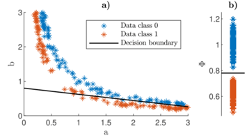

# Structural Identifiability Mapping

## Description
This repository contains the code that was used to perform the analysis and experiments presented in the research paper "On the importance of structural identifiability for machine learning with partially observed dynamical systems", by J. Norden et al.

 
In this paper, we address the problem of designing Machine Learning models which make use of partially observed dynamical systems which are structurally unidentifiable.
We demonstrate, that structurally identifiable parameter combinations can be effective features for subsequent classifier training.
We call this method of informing classifier traiing with structural identifiability analysis "Structural Identifiability Mapping" (or SIM for short).

The primary purpose of this project is to easily reproduce the results (figures and tables) featured in our research paper.
Beyond that, the code can also be used as a starting point for a new line of investigation and experimentation.

## Installation
To make use of the code provided in this repository, follow these steps:
1. Clone this repository / download the MATLAB code
2. Start a MATLAB session and navigate to the project root folder
3. Execute the desired script in MATLAB

In pricipal, no other steps are required, however, there are a few things to look out for:

- **MATLAB Version** The code was developed in MATLAB R2023b, so this version (or a later one) should be used
- **MATLAB toolboxes** Some of the MATLAB functions in use are part of specific MATLAB toolboxes that need to be installed separately. If, when trying to execute the code provided in this project, you are calling such a function and the corresponding toolbox is not installed, MATLAB will let you know and also point you to where you can get the required toolbox.
- **Parallel Processing** Some parts of the code make use of the parallel processing capabilities of MATLAB and require a parallel pool to start up.
This can sometimes take a while.
If, for whatever reason, you wish to run the code without parallel processing, navigate to the respective code and replace the "parfor"-loops with regular "for"-loops.

## Reproduction of results

The code may be used to simply reproduce the experimental outcomes presented in our paper. 
For this purpose, data stored from previously executed experiments is loaded from save-files and the desired figure/table is produced.
Alternatively, the code may also be used to rerun the experiments from scratch and with potentially different parameters.
To do so, check out the section on [General usage](#general-usage).

**Figures** The figures containing our simluation results may be reproduced by running the following scripts
- Figure 1 - `plot_decision_boundary_toy_model.m`
- Figure 4 - `plot_BR_example_ts.m`
- Figure 5 - `Experiment1_batch_reactor.m`, only run cells 2 and 5
- Figure 6 - `Experiment2_batch_reactor.m`, only run cells 2 and 6
- Figure 7 - `Experiment3_batch_reactor.m`, only run cells 2 and 6
The additional results contained in the supplementray material can be reproduced by running the script `Experimenti_system.m` where `i` is replaced by the number of the desired experiment and `system` is replaced by the name of the example system.

**Tables**
Tables III, IV and V presented in our paper may be reproduced by running the script `summaryTables.m`.

## General usage

### Directory structure
The root folder of this project contains three subfolders: `Figures/`, `Results/` and `Systems/`.

The `Figures/` folder contains all experimental figures included in our paper. 
Whenever an experiment is carried out, all produced figures are saved to this folder.

The `Results/` folder contains all experimental results stored as `.mat` files. 
Whenever an experiment is carried out, all results files are saved to this folder.
The naming convention for files in this folder is `experimentID_system-name_date-time.mat`, e.g. `pExperiment1_batch_reactor_202411111928.mat`. 
Note that in this case the "p" is added at the beginning to indicated that this result corresponds to one discussed in our paper.

The `Systems/` folder contains all files relating to the example dynamical systems discussed in our paper.
Each example system has its own subfolder.
Each subfolder contains the files: `set_systemInfo.m`, `SI_relation.m`, `solODE.m` and `systemInfo.mat`.

- the script `set_systemInfo.m` specifies a) the number `numStateVars` which indicates the number of state variables in the dynamical system, b) the vector `obsIdx` indicating which of the states is observed and c) matrix `ROI` which indicates the region of interest.
When the script is run, all these values are saved in the `systemInfo.mat` for later use.

- the function `SI_relation.m` takes as input the original model parameters and has as output the set of structurally identifiable parameter combinations found by prior structural identifiability analysis.

- the function `solODE.m` solves a given initial value problem associated with dynamical system.

### The dynamical_system.m class
A lot of functionality of this codebase is contained in the class `dynamical_system.m`.

In order to create an instance of this class, the name of a system in `Systems/` and an identifiability configuration (`ID` for identifiable or `UID` for unidentifable) need to be provided.
Once called, the constructor method loads all relevant data from the `Systems/` folder.
The class provides access to functions solving initial value problems, generating synthetic data for binary classifications tasks, the log-likelihood and conversion of Maximum Likelihood estimates from the original space of parameters to the space of structurally identifiable parameter combinations.

In order to add a new dynamical system, simply copy the folder of one of the already existing models, rename the folder and adjust the `set_systemInfo.m`, `SI_relation.m`, `solODE.m` and `systemInfo.mat` files.

#### Experiments

In order to rerun the experiments described in our paper from scratch, you can use the Experiment files.
The naming convention for these files is `ExperimentID_system_name.m`.
To rerun an experiment, simply adjust the configuration files `configExpID.mat` and `configHyperParameterTuning.mat` to the desired settings, then adjust the settings provided in the first few cells of `ExperimentID_system_name.m` and run the script.
Outputs are saved to the `Results/` folder automatically, from which they can be loaded for postprocessing (plotting etc.).

## Support
For support contact Janis Norden at j.norden@rug.nl.

## Authors and acknowledgment
"On the importance of structural identifiability for machine learning with partially observed dynamical systems" is authored by Janis Norden, Elisa Oostwal, Michael Chappell, Peter Tino and Kerstin Bunte.

## License
The project is licensed under the MIT license.
